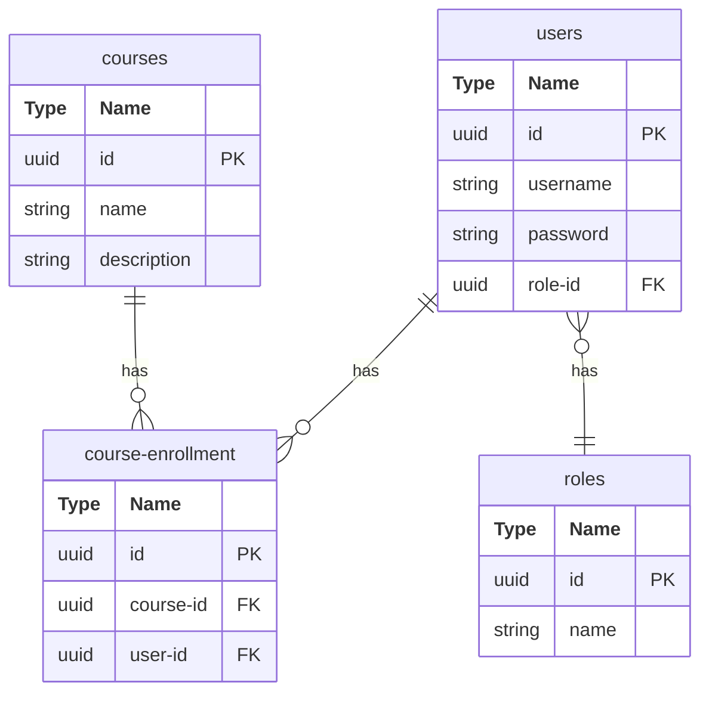

# Go Go LMS

## Purpose
To provide a secure system
* for Students to look at courses and enroll
* for Teachers to manage courses

## Database Structure

```mermaid
  erDiagram
    courses ||--o{ course-enrollment : has
    users ||--o{ course-enrollment : has
    users }o--|| roles : has

    courses {
      **Type** **Name**
      uuid id PK
      string name
      string description
    }

    course-enrollment {
      **Type** **Name**
      uuid id PK
      uuid course-id FK
      uuid user-id FK
    }
    
    users {
      **Type** **Name**
      uuid id PK
      string username
      string password
     uuid role-id FK
    }

    roles {
      **Type** **Name**
      uuid id PK
      string name
    }
    
```
