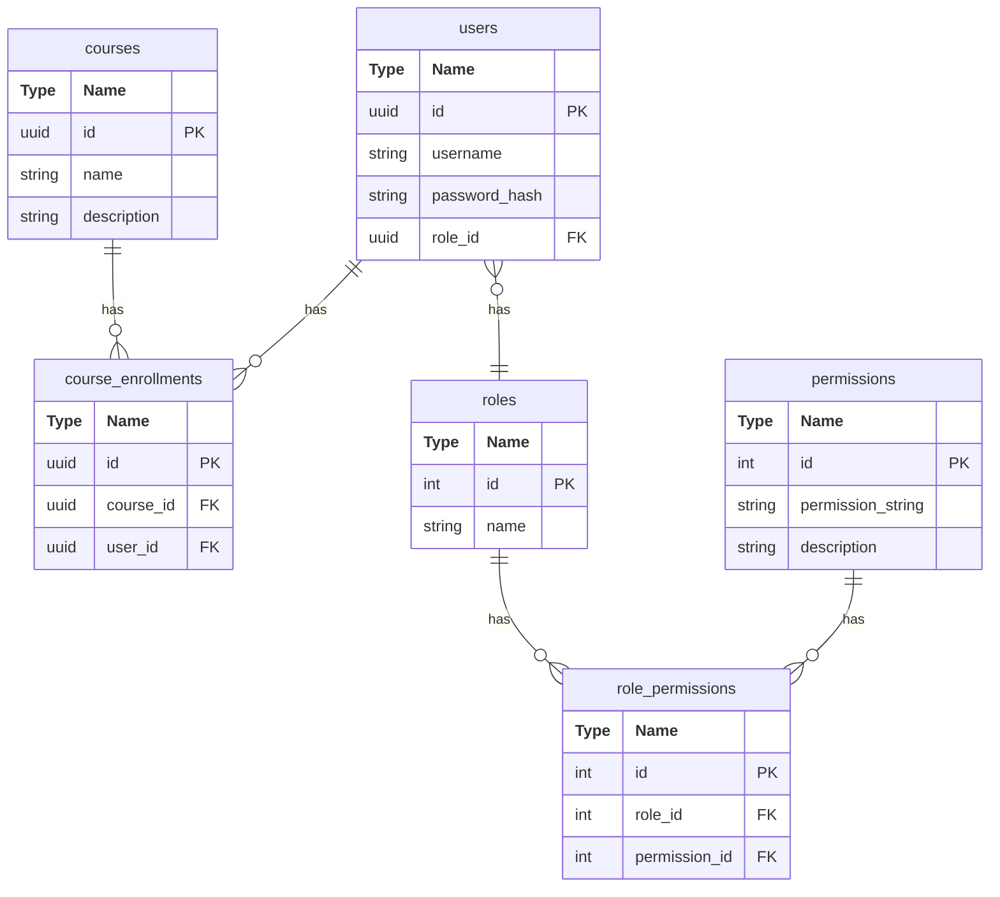

# Go Go LMS

## Purpose
To provide a secure system
* for Students to look at courses and enroll
* for Teachers to manage courses

# Technologies used

**Frontend** 
* **Framework**: ReactJS

**Backend** 
* **Framework**: Django
* **Authentication**: dj-rest-auth
* **User Roles**: django-role-permissions

**Database**: SQLite   

# How to start

**Backend**: ```python manage.py runserver```

## Database Structure

